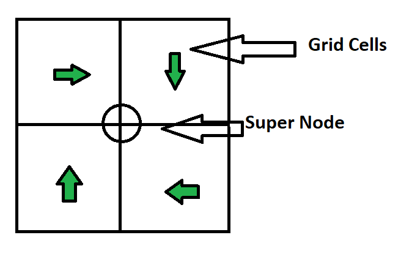
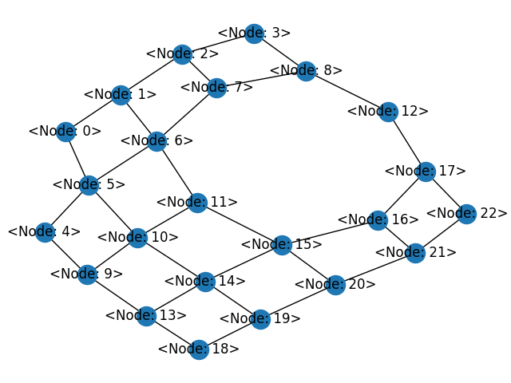
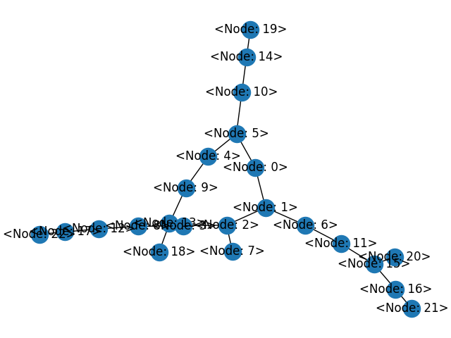
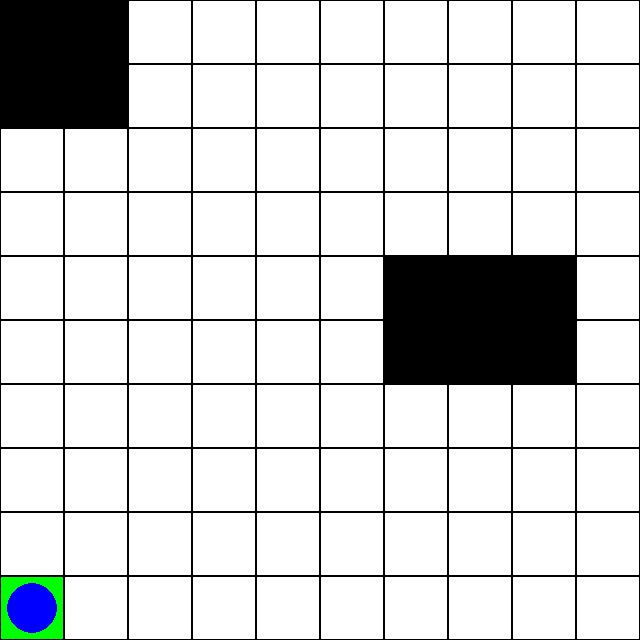
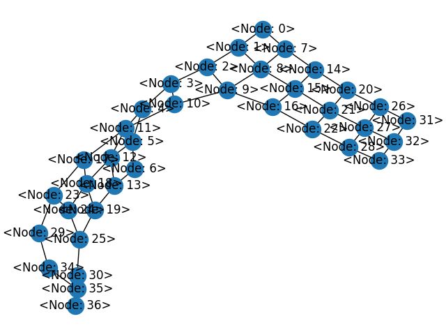
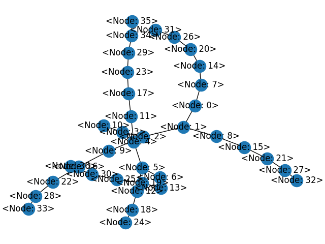
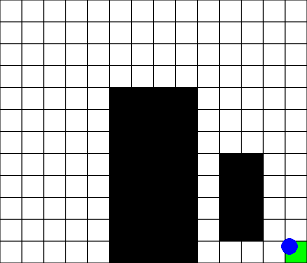
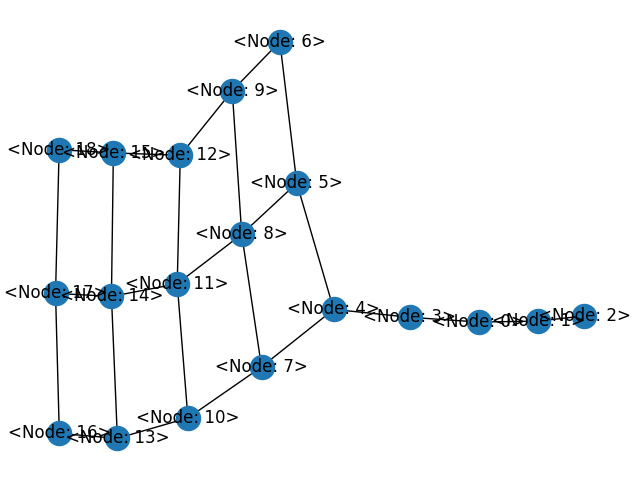
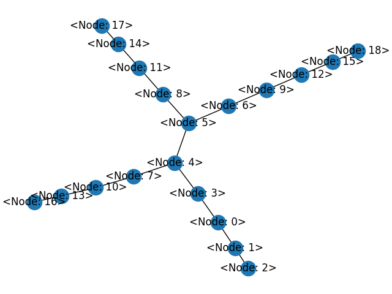
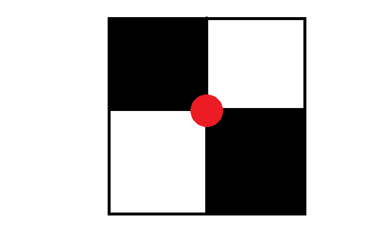

# Coverage Path Planning

The following code base contains coverage path planning for grid maps. The workflow of the path planner is as follows:

- Grid map is imported and super nodes are created for every four adjecent nodes
- Adjacent super nodes are connected to a graph based on the distance
- A minimum spanning tree is generated from the graph based on **Kruskal's algorithm**.
- From the spanning tree, the route of traversing nodes are identified
- Clockwise movement around super node is assumed for grid cells in the super node.
- Previous, current and next nodes are taken to identify the path of the robot along the super node spanning tree.

---

### Map 1
The super node graph for the map1 is shown below.

The minimum spanning tree (MST) of the graph which shows coverage of all areas in the map is shown below.

Clip of the path:

---

### Map 2
The super node graph for the map2 is shown below.

The minimum spanning tree (MST) of the graph which shows coverage of all areas in the map is shown below.

Clip of the path:

---

### Map 3
The super node graph for the map3 is shown below.

The minimum spanning tree (MST) of the graph which shows coverage of all areas in the map is shown below.

Unfortunately the algorithm does not work on odd size maps due to limitations.

---

## Limitations

- The algorithm works only for even sizes maps.
- The algorithm works on even sized obstacles. Currently the robot may traverse the obstacle if the other two cells are free since super node for those cells are considered for coverage.
- Since clockwise movement is assumed for traversing around and along super nodes, the robot will traverse additional cells than what is needed for optimal coverage.

## Overcoming limitations
The minimum spanning tree is very useful when considered coverage of an area since many constraints can be implemented. For example, if the robot has to charge between a particular number of steps, the tree depth can be shortened so that the robot reaches origin before the battery runs out.

Few improvements can be done on getting the grid cell path from the super node tree based on the obstacle occupancy of the cells and the previous visits to the cells.

For special cases when the super node is considered for grid cells with obstacles occupying diagonal cells, the graph can be disconnected to one of the super nodes so that it becomes a dead end.

The graph can be updated dynamically in realtime with updated occupancy map and new path can be generated with the minimum spanning tree which is cost effective considering other solutions.

---

## Information
The conda environment is provided as `environment.yml` file.

`main.py` is the main code to run to obtain the graph figures, path and animated gif.